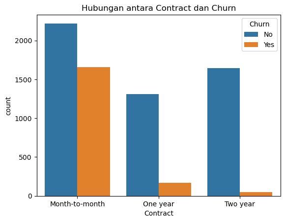
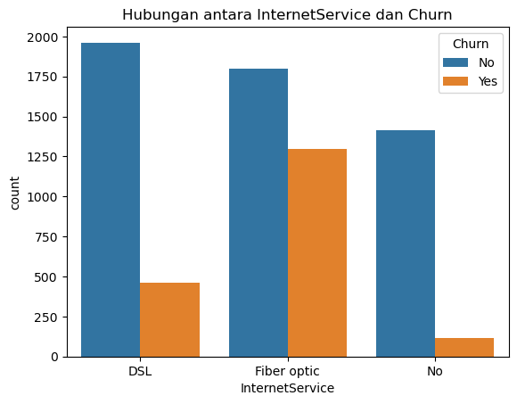
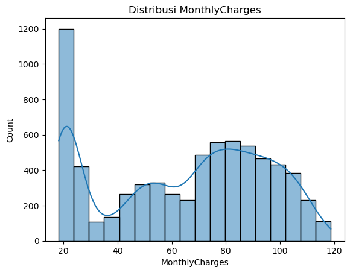

# Analisis-Prediksi-Churn-Pelanggan
Proyek ini menganalisis faktor yang menyebabkan churn pelanggan dan membangun model prediktif.

## Sumber Data
Dataset yang digunakan dalam proyek ini diambil dari **Kaggle**. Dataset ini berisi informasi tentang pelanggan layanan telekomunikasi dan apakah mereka telah berhenti menggunakan layanan (*churn*).

Dataset ini memiliki 21 fitur, termasuk:
- `CustomerId`: ID unik untuk setiap pelanggan.
- `Gender`: Jenis kelamin pelanggan (pria/wanita).
- `SeniorCitizen`: Apakah pelanggan merupakan lansia (ya/tidak).
- `Partner`: Apakah pelanggan memiliki pasangan (ya/tidak).
- `Dependents`: Apakah pelanggan memiliki tanggungan (ya/tidak).
- `Tenure`: Berapa lama pelanggan berlangganan.
- `PhoneService`: Apakah pelanggan menggunakan layanan telepon (ya/tidak).
- `MultipleLines`: Apakah pelanggan memiliki lebih dari satu saluran telepon.
- `InternetService`: Tipe layanan internet yang digunakan (DSL, Fiber Optic, No).
- `OnlineSecurity`: Apakah menggunakan fitur keamanan online (ya/tidak).
- `OnlineBackup`: Apakah menggunakan fitur backup online (ya/tidak).
- `DeviceProtection`: Apakah menggunakan fitur perlindungan perangkat (ya/tidak).
- `TechSupport`: Apakah menggunakan fitur dukungan teknis (ya/tidak).
- `StreamingTV`: Apakah menggunakan fitur streaming TV (ya/tidak).
- `StreamingMovies`: Apakah menggunakan fitur streaming film (ya/tidak).
- `Contract`: Tipe kontrak pelanggan (bulanan, tahunan, dua tahunan).
- `PaperlessBilling`: Apakah menggunakan fitur tagihan tanpa kertas (ya/tidak).
- `PaymentMethod`: Metode pembayaran yang digunakan.
- `MonthlyCharges`: Biaya bulanan yang dibayarkan.
- `TotalCharges`: Total biaya keseluruhan yang dibayarkan.
- `Churn`: Variabel target yang menunjukkan apakah pelanggan telah *churn* (ya/tidak).

## Tujuan dan Pertanyaan Analisis

Dalam proyek ini, saya berfokus pada dua tujuan utama:

1.  **Analisis Prediktif:** Membangun model yang mampu memprediksi dengan tingkat akurasi tinggi apakah seorang pelanggan akan *churn* atau tidak. Hasil dari model ini dapat membantu perusahaan mengidentifikasi pelanggan berisiko tinggi sejak dini.
2.  **Analisis Eksplorasi:** Menganalisis data pelanggan untuk menjawab pertanyaan-pertanyaan kunci seperti:
    * Faktor-faktor apa saja yang paling berkorelasi dengan *churn*?
    * Apakah jenis layanan tertentu mempengaruhi keputusan pelanggan untuk berhenti?
    * Apakah karakteristik pelanggan memainkan peran dalam *churn*?
  
## Metodologi
Proyek ini mengikuti alur kerja data science standar untuk analisis dan pemodelan prediktif. Setiap tahapan dijelaskan sebagai berikut:

1. Pembersihan dan Pra-pemrosesan Data (Data Cleaning and Preprocessing)
Tahap awal adalah membersihkan dan menyiapkan data untuk analisis. Langkah-langkah yang dilakukan:
- Mengidentifikasi dan mengatasi data yang hilang (missing values) pada kolom TotalCharges dengan mengisi data kosong menggunakan nilai median.
- Mengubah tipe data yang tidak sesuai. Kolom TotalCharges diubah dari tipe data objek (teks) menjadi numerik agar bisa digunakan untuk pemodelan.
- Melakukan encoding pada fitur kategorikal (teks) seperti Gender, Contract, dan InternetService menjadi format numerik agar bisa diproses oleh model.

2. Analisis Data Eksplorasi (Exploratory Data Analysis - EDA)
Analisis data dilakukan untuk memahami karakteristik data dan menemukan wawasan awal. Temuan utama dari EDA adalah:
- Pelanggan dengan kontrak bulanan memiliki tingkat churn yang jauh lebih tinggi dibandingkan dengan kontrak tahunan atau dua tahunan.
- Biaya bulanan yang tinggi dan masa berlangganan (tenure) yang pendek juga memiliki korelasi kuat dengan churn.

3. Pemodelan (Modeling)
Data dibagi menjadi training set dan test set dengan rasio 80:20. Dua model machine learning dipilih untuk dievaluasi:
- Logistic Regression: Model dasar yang baik untuk kasus klasifikasi biner seperti ini.
- Random Forest: Model yang lebih kompleks dan sering kali memberikan performa lebih baik karena kemampuannya dalam menangani hubungan non-linear antar fitur.
Model-model ini dilatih menggunakan training set dan kemudian diuji pada test set untuk memprediksi probabilitas churn pelanggan.

4. Evaluasi Model (Model Evaluation)
Kinerja kedua model dievaluasi menggunakan metrik yang lebih relevan untuk masalah imbalanced data seperti churn.

- Recall: Mengukur seberapa baik model dalam mengidentifikasi semua pelanggan yang benar-benar churn. Ini adalah metrik yang sangat penting untuk meminimalkan false negative (pelanggan yang seharusnya diprediksi churn tetapi tidak terdeteksi).
- F1-Score: Rata-rata harmonik dari precision dan recall. Metrik ini memberikan gambaran keseimbangan antara kedua metrik tersebut.
- ROC-AUC (Receiver Operating Characteristic - Area Under Curve): Mengukur kemampuan model dalam membedakan antara kelas positif dan negatif. Nilai ROC-AUC yang tinggi menunjukkan bahwa model memiliki performa yang baik.

## Hasil dan Wawasan (Results and Insights)
Analisis data telah mengidentifikasi beberapa wawasan kunci yang dapat memberikan pemahaman mendalam tentang faktor-faktor yang mendorong churn pelanggan.

Faktor Utama Pemicu Churn
Pelanggan dengan kontrak bulanan dan layanan Fiber Optic memiliki tingkat churn yang jauh lebih tinggi. Selain itu, biaya bulanan yang tinggi juga terlihat memiliki hubungan dengan churn.

<table>
<tr>
<td></td>
<td></td>
<td></td>
</tr>
</table>
Faktor-faktor seperti jenis kontrak, layanan internet, dan biaya bulanan memiliki korelasi kuat dengan churn. Pelanggan dengan kontrak bulanan dan layanan fiber optic cenderung lebih sering churn.

 

  

Pelanggan yang tidak berlangganan layanan pendukung seperti TechSupport cenderung lebih sering churn.

 

  

Pelanggan yang tidak memiliki ikatan keluarga (tanpa partner dan tanggungan) cenderung lebih mudah untuk churn.

 

  
  

  Model Random Forest yang telah di-tuning adalah pilihan terbaik karena secara efektif menyeimbangkan kemampuan untuk mendeteksi pelanggan churn (Recall) dengan akurasi prediksi secara keseluruhan.

 

Rekomendasi Bisnis yang Tepat
1. Program Retensi Bertarget: Gunakan model ini untuk mengidentifikasi pelanggan dengan probabilitas churn tertinggi. Tawarkan insentif seperti diskon, peningkatan layanan, atau dukungan khusus.
2. Analisis Fitur: Model menunjukkan bahwa fitur seperti 'Contract', 'InternetService', dan 'Tenure' sangat berpengaruh. Dorong pelanggan 'Month-to-month' untuk beralih ke kontrak jangka panjang. Jika layanan internet (misalnya Fiber optic) adalah penyebabnya, fokus pada peningkatan kualitasnya.
3. Optimalisasi Anggaran: Alokasikan anggaran dari kampanye retensi massal ke program retensi yang terfokus pada pelanggan yang benar-benar berisiko.
